# Physical AI Defect Image Generation

Provision an environment with the following resource requirements:

- 2 x RTX PRO Server 6000 (96 GiB)
- 1 TB storage
- 48 CPUs | 512 GB RAM

This guide describes a ready-to-use environment for generating synthetic defect images for automated optical inspection (AOI). The workflows combine USD rendering, image editing, and Cosmos AnomalyGen so teams can create labeled anomaly data for inspection models without waiting for every real defect to appear on a production line.

The environment pulls sample assets needed for PCBA, metal, and glass surface inspection so you can try different AOI cases without supplying your own data first. After you open Claw or your preferred coding agent, the prompt-driven workflow guides setup, validates the environment, and prepares the required assets before you run generation.

## Before You Run

Before you run any workflow, open Claw or your preferred coding agent in the deployed environment, gather the credentials below, and complete the extra setup noted for the glass use case.

- **NVIDIA Build API key, or your coding agent's API key** — Powers your agent harness for endpoint-backed model calls.
  - Create or manage your key at https://build.nvidia.com/settings/api-keys.
  - Alternatively, use NVIDIA Inference endpoints by creating or managing a key at https://inference.nvidia.com/key-management.
  - You can switch models from the Claw UI at any time, or optionally supply an Anthropic or Claude key to use third-party providers.
- **Hugging Face read token** — Required for gated model and dataset downloads.
  - First, accept the license or request access on each repository below (you must be signed in to Hugging Face):
    - Models
      - [nvidia/Cosmos-Predict2.5-2B](https://huggingface.co/nvidia/Cosmos-Predict2.5-2B) — Base Cosmos-Predict2.5 2B checkpoint from which AnomalyGen fine-tuned models are derived
      - [nvidia/Cosmos-AnomalyGen-PCB-2B](https://huggingface.co/nvidia/Cosmos-AnomalyGen-PCB-2B) — Finetuned AnomalyGen for PCBA defects (solder bridges, scratches, discoloration, missing components); `iter_14000` checkpoint
      - [nvidia/Cosmos-AnomalyGen-Metal-2B](https://huggingface.co/nvidia/Cosmos-AnomalyGen-Metal-2B) — Finetuned AnomalyGen for metal surface defects (cracks, scratches, pits); `iter_10000` checkpoint
      - [nvidia/Cosmos-AnomalyGen-Glass-2B](https://huggingface.co/nvidia/Cosmos-AnomalyGen-Glass-2B) — Finetuned AnomalyGen for glass surface defects (scratches, chips, contamination); `iter_9000` checkpoint
      - [nvidia/Qwen-Image-Edit-NVPCB-OVSL2SL](https://huggingface.co/nvidia/Qwen-Image-Edit-NVPCB-OVSL2SL) — Finetuned Qwen-Image-Edit on the NVPCB dataset; transfers Omniverse solder lighting to photorealistic real-world lighting
    - Datasets
      - [nvidia/Cosmos-AnomalyGen-PCB-Dataset](https://huggingface.co/datasets/nvidia/Cosmos-AnomalyGen-PCB-Dataset) — Sample images for the Day 1 - Texture defects workflow on PCBA
      - [nvidia/Spark-AnomalyGen-USD](https://huggingface.co/datasets/nvidia/Spark-AnomalyGen-USD) — USD scenes, materials, and real input images used by both the Day 0 and Day 1 workflows on PCBA
      - [nvidia/Cosmos-AnomalyGen-Glass-Masks](https://huggingface.co/datasets/nvidia/Cosmos-AnomalyGen-Glass-Masks) — Masks-only assets for the glass demo (pair with your own prepared Roboflow pixels; refer to [this guide](./media/glass_dataset_download_instructions.md) for how to create the zip file needed to set up the glass use case pre-requisites). After you have the zip locally, copy it to a location in the target environment (eg: `/home/ubuntu/mobile_screen.zip`) using your preferred file-transfer method.
  - Then create a read token at https://huggingface.co/settings/tokens/new?tokenType=read.
- **NGC credentials** — not required. The workflow container images are public on `nvcr.io/nvidia/` and pull anonymously (all model and dataset assets live on Hugging Face). An NGC/registry credential is only needed as a fallback if image pulls fail (e.g. `nvcr.io` rate-limiting).

Once you have your secrets (NVIDIA Build API Key or Coding Agent's API Key and Hugging Face) ready to go, paste the prompt below into OpenClaw or your coding agent's chat to start setup. The agent runs credential preflight checks (asking for anything it can't find), validates storage defaults and cluster pod templates, then submits OSMO workflows to pull and process the data and models needed for the use cases, plus USD assets for all use cases on PCBA — about 12 minutes on the default environment.

```text
Setup the defect image generation workflow pre-requisites for all use cases including a local qwen image edit endpoint. My glass zip is located at /home/ubuntu/mobile_screen.zip. Ensure nvoptix and shm requirements are sufficient for running the workflows. Here is my huggingface token : hf-xxx. 
```

**Optional tweaks before you send it:**

- **Different storage backend** — the default configuration uses a MinIO-backed profile (default `s3://osmo-workflows/dig`) that the agent recommends and is fine for the demo. To use a different backend (S3, GCS, Azure Blob, Torch Object Storage, or any other OSMO-supported storage), give your coding agent the credential payload from [OSMO's Setup Credentials → Data guide](https://nvidia.github.io/OSMO/main/user_guide/getting_started/credentials.html#credentials-data) and it will configure your data profile and default DIG results path.
- **Existing Qwen Image Edit endpoint** — replace "local qwen image edit endpoint" in the prompt with your endpoint URL when the agent asks (or when you submit a generation workflow later).

> **Monitor progress:** use the OSMO service URL or OSMO CLI to watch task status and logs, or ask the agent to set up a cronjob that reports setup status back in chat. See [Monitoring Runs and Retrieving Outputs](#monitoring-runs-and-retrieving-outputs) for more.

When setup finishes, prompt OpenClaw or your coding agent with `/bootstrap` to see the flows supported in the runtime environment, including other Physical AI data generation workflows.

## What Defect Image Generation Workflows Do

Defect Image Generation workflows produce defect examples for visual inspection use cases such as missing PCBA components, solder bridges, metal cracks, and glass scratches. A workflow starts from clean inspection inputs, adds realistic defects, and writes labeled outputs that you can review, download, or use to train downstream models.

The Defect Image Generation skill includes five practical paths:

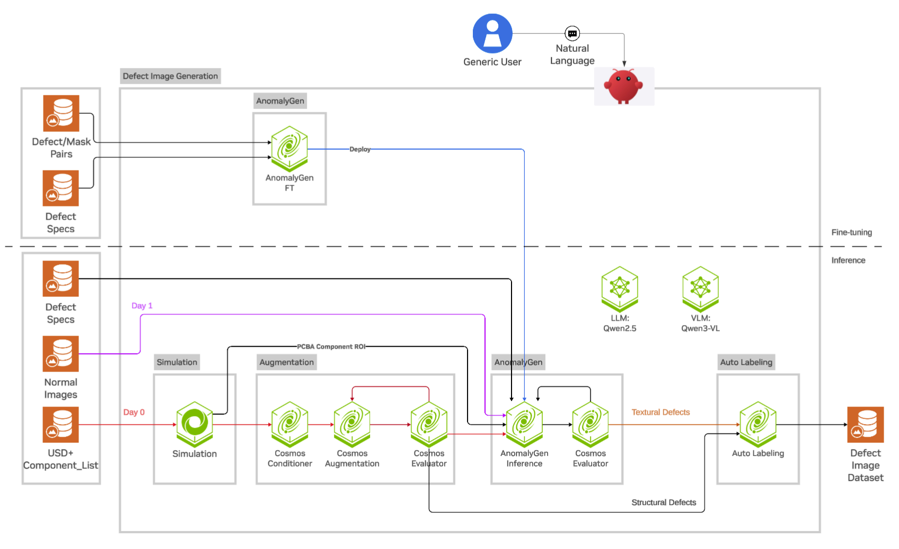

| Flow | Use when you have | Typical use cases | Output |
|---|---|---|---|
| Day 0 - Good images | USD assets, want clean baseline / ChangeNet golden halves | PCBA clean-image set, lighting demos, finetune positives | Scan-grid renders → per-component crops → Qwen lighting-transferred RGBs |
| Day 0 - Structural defects | USD assets, want pose defects (shift, tombstone, sideflip) | PCBA pose-defect training data, ChangeNet defect halves | Pose-perturbed renders → per-component crops → Qwen lighting-transferred RGBs |
| Day 0 - Texture defects | USD assets, want texture-based defects (solder bridge, scratch, discoloration, missing component) | PCBA boards with USD scenes | Rendered clean crops, edited board crops, generated texture defects, labels |
| Day 1 - Texture defects | Clean inspection images, ROI masks, or prepared AOI datasets | Metal surface, glass, pre-captured PCBA images | Generated defects and labels from real or prepared clean inputs |
| Finetune & Inference | A labeled defect dataset | Custom cases or new defect families | A reusable AnomalyGen checkpoint that can be used by the Day 0 or Day 1 generation workflows |

## Day 0: Good Images and Structural Defects

Day 0 Defect Image Generation targets the earliest stage of a PCBA project, when the board exists in USD format but you might not yet have real inspection images.

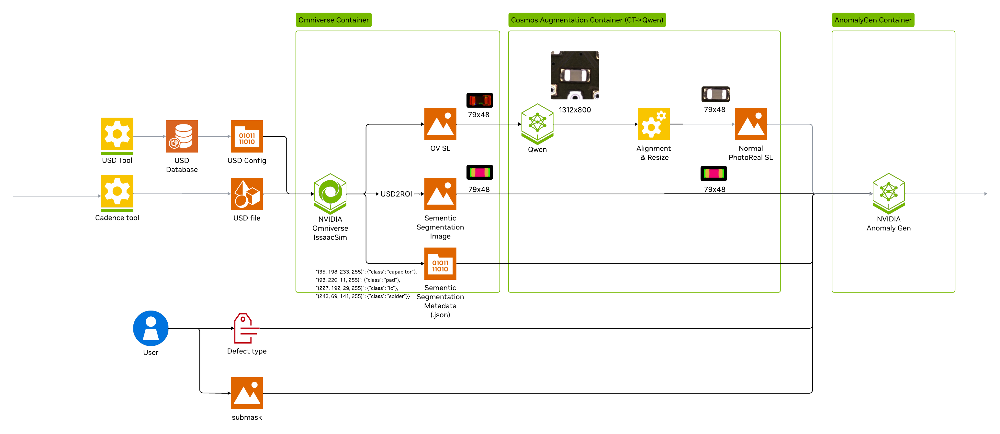

### The Workflow

1. Renders PCBA component regions from a USD scene with Simulation skill.
2. Uses Augmentation skill to transform Omniverse-rendered crops with simulation lighting into realistic solder-lighting inspection images.
3. (Optional) Uses AnomalyGen skill to synthesize defect images.
4. Emits labeled output such as defect images, masks, crops, and annotations in `SDG_result.csv`.

Both **Day 0 - Good images** and **Day 0 - Structural defects** use the simulation skill, which drives Isaac Sim to render electronic components on the PCBA board digital twin in USD format. The Augmentation skill then uses Qwen-Image-Edit to improve the photorealism of Isaac Sim rendered images.

- **Good image** renders clean PCBA component areas with lighting, camera, and material randomization. The simulation skill supports domain randomization in scan-grid, single-component zoom, and four lighting profiles (ring, dome, scene, preserve-color) in this version. Output is per-component image crops with labels. The good or clean image and label pairs serve as positive samples in AnomalyGen and in downstream model post-training or fine-tuning datasets.
- **Structural defects** renders pose defects (shift, tombstone, sideflip) procedurally inside Isaac Sim. Qwen-Image-Edit-based augmentation improves image photorealism.

Example requests:

```text
Generate good images of 0603-H100 asset, set max image emit count to 3.
```

```text
Generate shift structural defects for 115_2819_000, with full board coverage.
```

> After submission, see [Monitoring runs and retrieving outputs](#monitoring-runs-and-retrieving-outputs) for status checks, logs, and downloading results.

### Examples:
| Prompt | USD View | Generated Image |
| --- | --- | --- |
| <br><br><br> Generate **good** images of _115-2819-000 asset, with full board coverage. <br><br><br><br> | 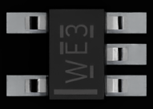 | 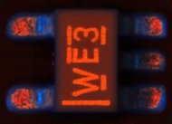|
| <br><br><br> Generate **shift** structural defects for 115_2819_000, with full board coverage. <br><br><br><br> | 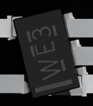 | 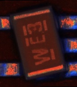|

## Day 0 - Textural Defects

The Day 0 Defect Image Generation workflow requires a reachable image-edit endpoint for the lighting and appearance transfer step. You can point the workflow at an existing endpoint, or ask the agent to use the local Qwen Image Edit deployment option documented with the skill. Example prompts:

```text
Run Day 0 for component 0603_H100 to generate excess solder and missing defects. 
```

### How to Specify the PCBA Component

The workflow includes the digital twin of the [NVIDIA DGX Spark](https://www.nvidia.com/en-us/products/workstations/dgx-spark/) motherboard PCBA in USD format as a sample. The [Sample PCBA Electronic Components](#sample-pcba-electronic-components) table lists several electronic component types on the PCBA. Each row describes the package category, component type ID, the top-down view of the USD representation, and the dimensions. When you specify one or more component types in the prompt, the workflow generates photorealistic defect images for them. For example, select component type `_115-2819-000`, an SOT-5 or SOT-6 packaged component, from the table. Then instruct the agent to generate defect images for it:

```text
Run Day 0 for component _115-2819-000 with full board coverage to generate bridge defects.
```

> After submission, see [Monitoring runs and retrieving outputs](#monitoring-runs-and-retrieving-outputs) for status checks, logs, and downloading results.

### Examples
| Prompt | USD View | Generated Image |
| --- | --- | --- |
| Run Day 0 for component 0603_H100 to generate **excess solder** defect. | 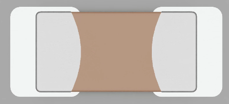 | 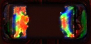 |
| <br><br><br> Run Day 0 for component 115_2819_000 with full board coverage to generate bridge defects. <br><br><br><br> | 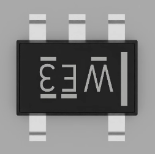 | 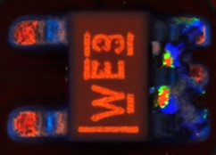|

## Day 1 - Textural Defects: Start From Inspection Data

Day 1 Defect Image Generation applies when you already have clean images, ROI masks, or a real AOI screenshot that should be aligned to USD-derived regions.

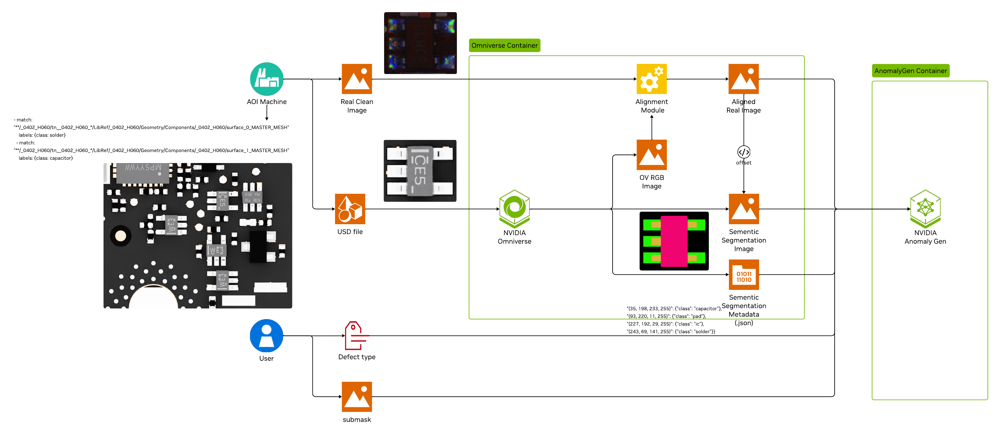

### The Workflow

- Use shipped, prepared datasets for PCBA, metal, or glass surface.
- Use a pretrained checkpoint for defect image generation.
- Post-train AnomalyGen first, then generate defects with the workflow.

The Day 1 Defect Image Generation workflow does not require an image-edit endpoint unless you are separately preparing new visual augmentation assets. It mainly uses the packaged dataset and checkpoint assets for the selected case. Sample prompts:

```text
Run the day 1 defect image generation workflow to generate images of metal surface defects using the shipped metal checkpoint and generate all the defect types it ships with.
```

```text
Run day 1 defect image generation workflow for glass using the packaged sample assets. Generate oil, scratch, and stain defects with the shipped glass checkpoint.
```

### Specify the PCBA Component ROI Masks

Sample normal images on PCBA components are accompanied by region of interest (ROI) masks for each image. To test the Defect Image Generation workflow on your own PCBA component, supply ROI masks for those components. If you do not supply ROI masks, the workflow estimates them from the input image.

The workflow lists several sample PCBA component types in the [Sample PCBA Electronic Components](#sample-pcba-electronic-components) table. If your PCBA component matches one of these sample types, the workflow can generate highly accurate ROI mask ground truth using the digital twin instead of estimation. For example, the image below shows a 5-pin chip called an SOT-5 or SOT-6 IC.

!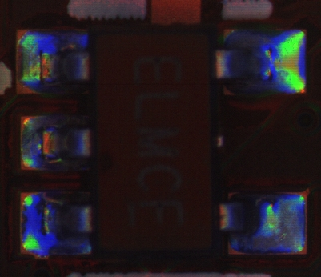

Identify component type `_115-2819-000`, which closely represents the component in the real image, by rotating the USD top-view image below counterclockwise 90 degrees to define the input image component ROI masks.

!

Then instruct the agent to generate defect images on the input image for that component type:

```text
Run Day 1 for component _115-2819-000 with its real image to generate bridge defects.
```

> After submission, see [Monitoring runs and retrieving outputs](#monitoring-runs-and-retrieving-outputs) for status checks, logs, and downloading results.

### Examples
| Prompt | Clean Image | Generated Image |
| --- | --- | --- |
| Run Day 1 for component 0603_H100 to generate **missing** defects. | 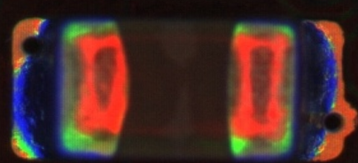 | 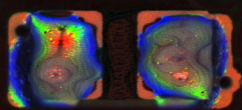 |
| <br><br><br> Run Day 1 for component 115_2819_000 with its real image to generate **bridge** defects. <br><br><br><br> | 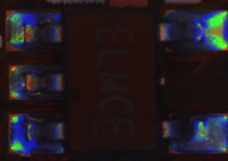 | 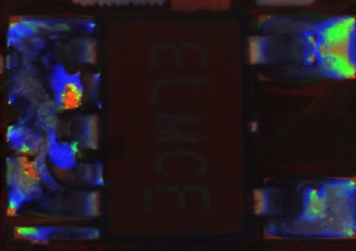|

## Finetune & Inference

When you want an AnomalyGen adapted to your own labeled dataset before generation, ask the agent to run Day 0 or Day 1 workflows with finetuning enabled. This pipeline first trains a fresh AnomalyGen checkpoint against the prepared dataset, then immediately runs generation with the result. Below are a couple of sample prompts. You may limit the maximum finetuning iteration steps, e.g. to 2000 steps, for quick smoke tests.

```text
Run Day 0 for component _115-2819-000 with full board coverage to generate bridge defects. Finetune with the default PCB dataset to step 10000 and use this 10000-step checkpoint to generate defects.
```

```text
Run the day 1 workflow to generate images of metal surface defects. Finetune with the default metal dataset to 10000 steps and use 10000-step checkpoint to generate at most all the defect types.
```

```text
Run Day 1 for glass using the packaged sample assets. Finetune with the default glass dataset to 10000 steps and use this 10000-step checkpoint to generate oil, scratch, and stain defects.
```

```text
Run Day 1 for component _115-2819-000 with its real image to generate bridge defects. Finetune with the default PCB dataset to step 10000 and use this 10000-step checkpoint to generate defects.
```

> After submission, refer to [Monitoring Runs and Retrieving Outputs](#monitoring-runs-and-retrieving-outputs) for status checks, logs, and downloading results.

## Monitoring Runs and Retrieving Outputs

Every setup and generation request in Claw submits an OSMO workflow that you can monitor interactively using the OSMO service URL for your environment. After the agent returns a workflow ID, you can continue in Claw or use the OSMO CLI directly from the runtime environment. By default, long-running tasks run as subagents.

### From Claw

Ask prompts such as:

```text
What's the status of my last Defect Image Generation workflow?
```

```text
Show me the logs for the anomaly-infer task in workflow <workflow-id>.
```

```text
Download the outputs of all groups of workflow <workflow-id> to /home/ubuntu/dig-results.
```

```text
Monitor workflow <workflow-id> every 2 minutes and report back once it is done with a quick preview grid image of the original image, usd roi generated cad masks, AMP placed masks along with the reconstructed anomalygen result for the different defect types. 
```

### What You Get Back

For a defect-generation run, the downloaded bundle contains:

- `reconstructed_image/`, `annotated_image/`, `cropped_image/`, `cropped_mask/`, `original_image/`, `original_mask/`
- `SDG_result.csv` with per-image labels and run metadata
- For Day 0 flows, the upstream `usd2roi-components/` and `augment/` trees are also preserved under `runs/<name>/`

## What You Can Build With This

You can use this environment to:

- Generate a PCBA surface defect dataset from the PCBA board digital twin in USD format before you collect real defects.
- Expand a small set of clean inspection images into labeled anomaly examples.
- Compare pretrained AnomalyGen checkpoints across PCBA, metal, and glass surface defect cases.
- Fine-tune the base AnomalyGen model with a defect image dataset, then apply the fine-tuned model in Day 0 or Day 1 Defect Image Generation workflows.
- Produce output packages with images, masks, crops, annotations, and run metadata for review or downstream model training.

The agent uses the skill to guide you through infrastructure configuration, credentials, dataset URLs, checkpoint selection, and endpoint selection where needed.

## Notes

1. The electronic component types included in the supplied PCBA USD are not complete.
2. If you do not supply component ROI masks, the workflow uses a Qwen3 and SAM2 based ROI Generator to estimate them. Defect image quality depends on ROI mask accuracy.

## Getting the Most Out of the Agent

A few habits that make the prompt-driven flow noticeably smoother:

- **Be explicit about the use case.** Name the surface (PCBA / metal / glass) and the flow (Day 0 / Day 1 / Finetune & Inference) up front so the agent picks the right cookbook on the first try instead of asking back. Example: `Run Day 1 for glass using the packaged sample assets to generate scratch and stain defects.`
- **Match prompt detail to the model's reasoning strength.** The Claw chat model is configurable — stronger reasoning models (e.g. Claude Opus / Sonnet) can infer intent from terse prompts, while smaller or non-thinking models lean heavily on what you spell out. If you switch to a lighter model, be more explicit about the flow, component, defect types, counts, and any non-default endpoints or paths to keep results consistent.
- **State your bounds.** Mention the component (e.g. `_115-2819-000`), defect types, image counts, and finetune step caps in the same prompt. Vague prompts like "generate some defects" force the agent to pick defaults that may not match what you want.
- **Hand it credentials and paths inline.** When you already have your Hugging Face token, glass zip path, or an existing Qwen Image Edit endpoint URL, paste them directly into the prompt — the agent will skip the back-and-forth and go straight to workflow submission.
- **Reuse the example prompts.** Each section above (`Day 0`, `Day 1`, `Monitoring`) ships with copy-pasteable prompts. Treat them as templates: change the component, defect type, or workflow ID and you're done.
- **Let long-running jobs run as subagents.** Submission, monitoring, and download tasks default to subagents so your main chat stays responsive — ask things like `Monitor workflow <id> every 2 minutes and report back when it's done` instead of blocking on it yourself.
- **Ask for previews, not just status.** Prompts like `report back with a preview grid of original, ROI mask, AMP-placed mask, and reconstructed anomaly` give you a much faster visual sanity check than scrolling raw output folders.
- **When in doubt, ask the agent.** It has the skill loaded — `What component types ship with the sample USD?` or `What's the difference between Day 0 textural and Day 1 textural?` are valid prompts and faster than digging through this doc.

## Appendix

### Sample PCBA Electronic Components

| Package Category | Component Type | USD View | W (mm) | L (mm) | H (mm) |
| --- | --- | --- | --- | --- | --- |
| Chip Passive Component | _0603-H100 |  | 2.10 | 0.90 | 1.00 |
| SOT-5 / SOT-6 | _115-2819-000 |  | 2.10 | 2.00 | 1.10 |
