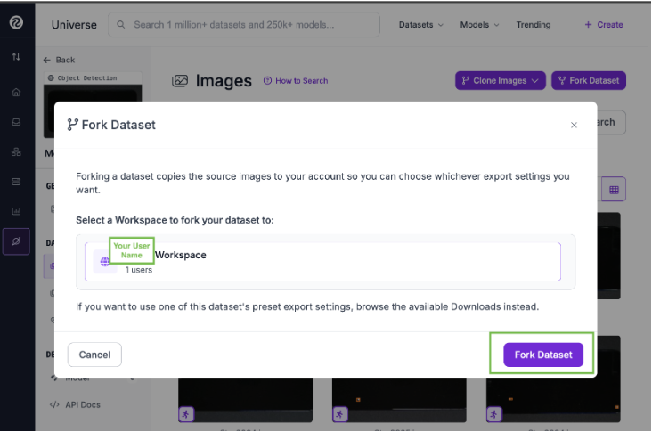
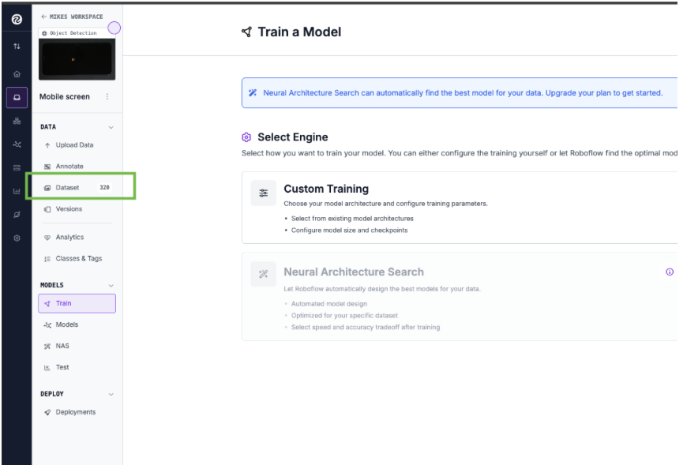
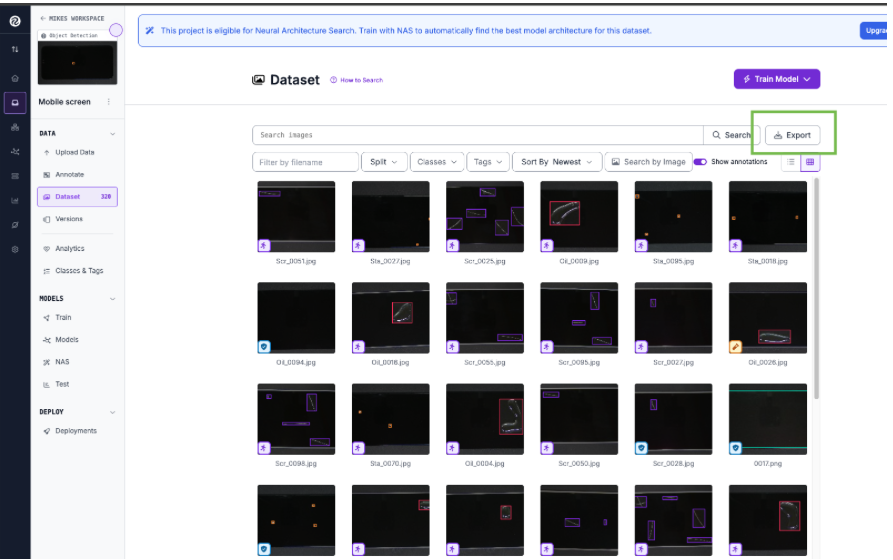
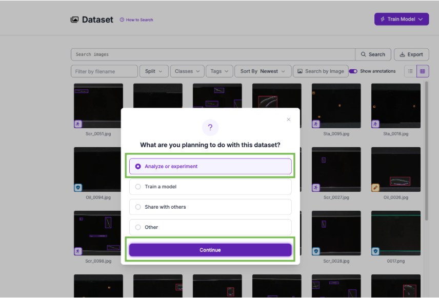
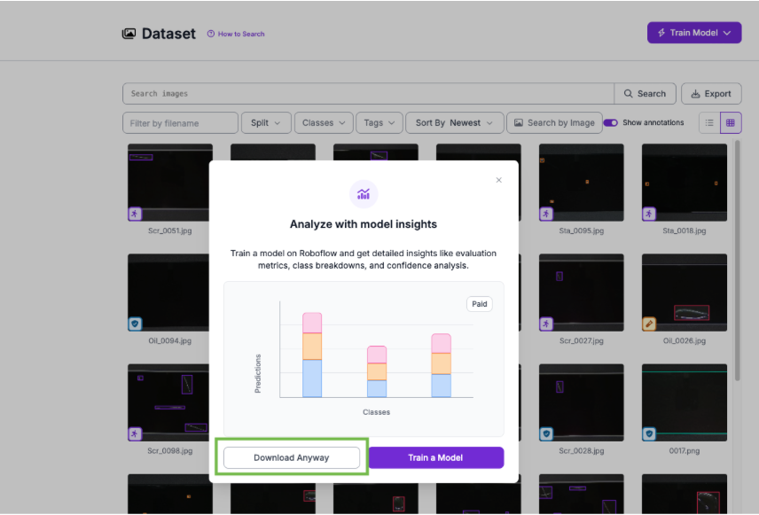
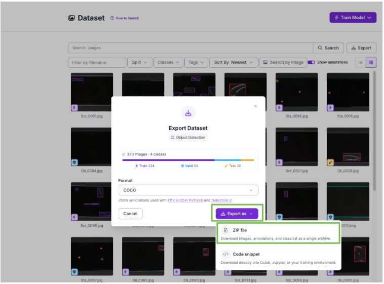
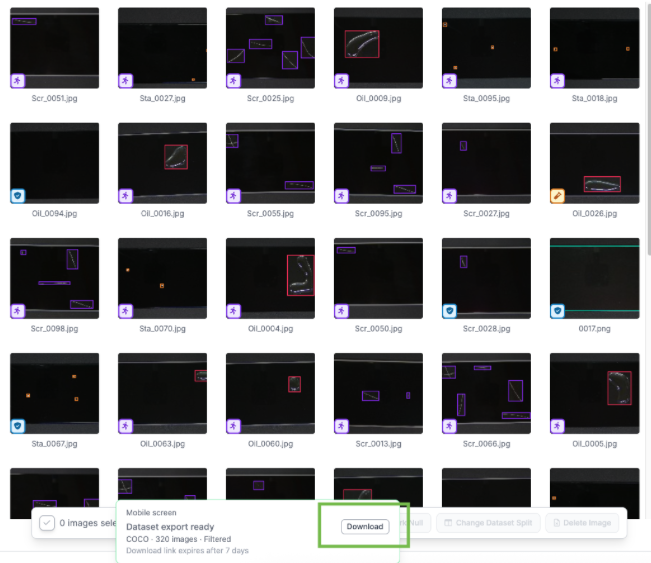

# UC1.3 Dataset Download for AOI Launchable Demo

Follow these steps to download the Mobile Screen dataset from Roboflow and prepare it
for the glass surface defect image generation workflow.

## 1. Open the Roboflow Dataset Page

Go to the dataset Roboflow page (you may need to register or sign in to your own account):

<https://universe.roboflow.com/vu-thi-thu-huyen/mobile-screen>

## 2. Fork the Dataset

1. Click **Use this Dataset**.
2. Click **Fork Dataset**. This copies the files to your own Projects/Workspace.

> **Note:** You may need to set up your Projects/Workspace page the first time.

## 3. Export the Dataset

1. In your own Projects/Workspace, open the **Mobile screen** page and select **Dataset** on the left bar.

   

2. Click **Export** in the top-right corner of the page.

   

3. Choose **Analyze or experiment** and click **Continue**.

   

4. Click **Download anyway**.

   

5. Click **Export as** and choose **ZIP file**.

   

6. When the export is ready, a **Download** button appears at the bottom of the page. Click it to download the zip file to your local machine.

   

## 4. Upload the Zip to the Launchable

After downloading, drag the zip file from your local machine into the launchable's
workspace (or use any other upload method).

## 5. Provide the zip path to the agent during setup time

That's it — no manual extraction or prep script is required. When you kick off
the glass setup, just tell the agent where the zip is on the launchable (for
example, `/home/ubuntu/mobile_screen.zip`) and it will handle the rest:

- Stage the zip into OSMO storage under the expected prefix.
- Run the `setup_glass` workflow, which extracts `Phone/anomaly_image/` and
  `Phone/clean_image/` from your zip and pulls the matching masks and
  `defect_spec.jsonl` from the
  [`nvidia/Cosmos-AnomalyGen-Glass-Masks`](https://huggingface.co/datasets/nvidia/Cosmos-AnomalyGen-Glass-Masks)
  dataset on Hugging Face (gated — accept the license once with the HF account
  tied to your `HF_TOKEN`).
