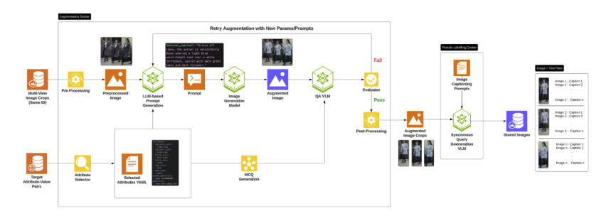
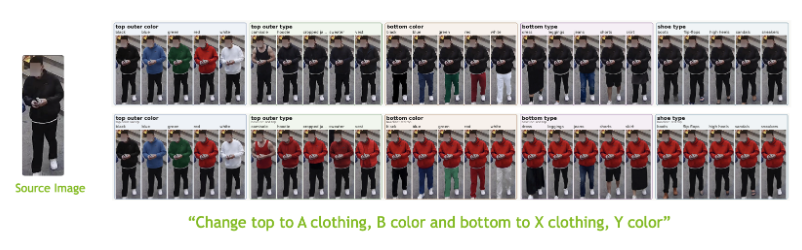
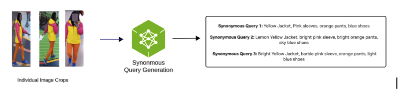

# Physical AI People Attribute Search

Provision an environment with the following resource requirements:

- 4 x RTX PRO Server 6000 (96 GiB)
- 1 TB storage
- 96 CPUs | 1 TiB RAM

> Peak concurrent demand is 3 GPUs (the Image-Edit, VLM, and LLM endpoints run
> side by side). The recommended AWS + 4 x GPU launchable setting leaves
> headroom for scheduling.

This guide describes a ready environment for running people attribute search
(PAS) image augmentation and auto-labeling workflows on NVIDIA OSMO. It is
designed for teams that want to expand person-crop datasets with controlled
clothing/appearance variations plus structured attribute labels and search
queries, without wiring the full stack manually.

The workflow is driven through the in-repo skill under `skills/physical-ai-people-attribute-search/` and supports both quick demo runs and production runs against your own datasets.

## Before You Run

Before running any workflow, open Claw or your preferred coding agent in the deployed environment and gather the credentials below:

- **NVIDIA Build API key, or your coding agent's API key** — Powers your agent harness for endpoint-backed model calls.
  - Create or manage your key at https://build.nvidia.com/settings/api-keys.
  - Alternatively, use NVIDIA Inference endpoints by creating/managing a key at https://inference.nvidia.com/key-management.
  - You can switch models from the agent UI at any time, or optionally supply an Anthropic/Claude key to use third-party providers.

- **Hugging Face read token** — required for gated model downloads. Accept model terms for all three Qwen models PAS uses:
    - [Qwen-Image-Edit-2511](https://huggingface.co/Qwen/Qwen-Image-Edit-2511)
    - [Qwen3-VL-30B-A3B-Instruct](https://huggingface.co/Qwen/Qwen3-VL-30B-A3B-Instruct)
    - [Qwen2.5-14B-Instruct](https://huggingface.co/Qwen/Qwen2.5-14B-Instruct)
  - Create a read token:
    - [Hugging Face token page](https://huggingface.co/settings/tokens/new?tokenType=read)

- **NGC credentials (optional)** — optional for this environment's default PAS workflow path; default PAS image references are public. Provide an `nvapi-*` token only if you need an `nvcr_io` credential refresh.

Complete onboarding before you ask Claw or your coding agent to run setup or submit workflows.

## What This Workflow Does

The environment orchestrates OSMO workflows that implement a GPU-accelerated,
multi-stage pipeline. The pipeline augments existing person-crop datasets by
generating controlled clothing/appearance variations (image-domain) and
synonymous attribute captions with search queries (text-domain). It uses
[Qwen-Image-Edit-2511](https://huggingface.co/Qwen/Qwen-Image-Edit-2511) for
image-edit augmentation with MCQ verification, a VLM (`qwen3-vl`) for
verification and person-attribute captioning, and an LLM (`qwen25-14b`) for MCQ
question generation.



The workflow can run in three modes:

| Mode | What runs | Typical use |
|---|---|---|
| `e2e` | setup → augmentation → auto-labeling | Default for "augment person crops and label" requests |
| `augmentation` | setup → augmentation | Generate clothing/appearance variations only, no captioning |
| `auto_labeling` | setup → auto-labeling | Attribute captions + search queries on pre-augmented crops |

The workflow stages scripts and configs, launches worker tasks, and writes outputs to object storage for download and inspection.

### Image Domain: What the Augmentation Produces

Given a source person crop, the augmentation stage uses Qwen-Image-Edit-2511 to generate a controlled grid of clothing and appearance variations — changing top garment type, color, bottom garment type, and color systematically. Each variation is verified by MCQ before being written to output.



Each generated variation includes:
- `aug_<n>/output.jpg` — the augmented multi-pane image
- `aug_<n>/output.txt` — a natural-language caption describing the change
- `aug_<n>/output_metadata.json` — MCQ verification results for that variation

### Text Domain: Synonymous Query Generation

For each augmented identity, the VLM and LLM work in tandem to produce multiple synonymous natural-language search queries — different phrasings of the same person's appearance that enable robust person re-identification and attribute-search model training.



These are written to `dataset/augmented_data.json` as structured attributes alongside the search queries.

### Pipeline Stages

| Stage | Name | Purpose | Parallelism |
|-------|------|---------|-------------|
| 1 | Setup | Stage scripts/configs, validate credentials, confirm endpoints are healthy | Single task |
| 2 | Augmentation | Preprocess multi-view crops into panes, generate variations via image-edit + MCQ verification, post-process and split views | Dynamic workers |
| 3 | Auto-Labeling | Person-attribute captioning and search-query generation on augmented crops | Dynamic workers |

## First-Time Setup

Before the first workflow run, copy the person-crop dataset you want to process
to a location accessible from the target environment. PAS ships **no built-in
demo dataset** — you must supply person crops (see [Sample Data](#sample-data)).

The agent will:

- Verify OSMO login, profile, and pool.
- Validate credentials (`hf_token`, DATA credential, and optional `nvcr_io` refresh when provided).
- Reuse healthy in-cluster NIM endpoints (`qwen-image-edit-2511`, `qwen3-vl`, `qwen25-14b`) or deploy them via the NIM operator.
- Confirm `/v1/models` readiness for the Image-Edit, VLM, and LLM endpoints.
- Run preflight checks.
- Stage input data and submit the workflow.
- Monitor until completion and return output URLs.

> **Important — the image-edit endpoint must be vLLM-Omni, not the Triton NIM.**
> The augmentation worker calls the image-edit model via
> `client.chat.completions.create(...)`, so the endpoint **must** expose
> `/v1/chat/completions`. The checked-in manifest runs
> `vllm serve Qwen/Qwen-Image-Edit-2511 --omni`; the `--omni` flag is required.
> Do not deploy the Triton-based `nvcr.io/nim/qwen/qwen-image-edit` NIM — it
> serves `/v1/infer` + `/v1/images/edits` but not `/v1/chat/completions`, so
> every image-edit call returns `404` (symptom: captions/metadata produced but
> no augmented images).

## Input Options

You can run from any of the following:

- Your own dataset URL in object storage (`s3://`, `swift://`, and so on), or
- A local folder uploaded during the run.

PAS requires person-crop images organized as `<person_id>/<view>.jpg`
subdirectories. There is no built-in demo dataset, so always supply your own
person crops.

### Sample Data

Use public Re-Identification or Attribute Search datasets that include person
object crops, preferably with multi-view samples. Users must download the
dataset before running the pipeline. A few recommended starting points are
listed below:

- https://github.com/NjtechCVLab/RSTPReid-Dataset
- https://www.kaggle.com/datasets/meetrathi97/icfg-pedes/data
- https://www.kaggle.com/datasets/yuulind/pa-100k

The user may need to preprocess the data into the format below:

```text
/folder
├── person_0001/
│   ├── view_a.jpg
│   ├── view_b.jpg
│   └── view_c.jpg
├── person_0002/
│   ├── view_a.jpg
│   └── view_b.jpg
└── ...
```

> **Tip:** Prefer well-lit, full-body, unobstructed crops, and keep all views of
> a given `person_id` from the **same real identity** (multi-camera datasets like
> RSTPReid encode identity in the filename). Tight head/shoulder close-ups and
> garments obscured by foreground objects are harder for the image-edit model to
> augment reliably.

## Example Prompts

```text
Run the People Attribute Search (PAS) end-to-end pipeline on a 2-person dataset at <path or s3 location>, generating attribute captions and search queries. Output to /home/ubuntu/output/.
```

```text
Generate 3 clothing and appearance variations for each person in my dataset at <path or s3 location>. Augmentation only, no captioning.
```

```text
Generate person-attribute captions and search queries for my already-augmented person crops at <path>. Labeling only.
```

## Typical Outputs

Successful runs produce OSMO output artifacts such as:

For `augmentation` / `e2e`:

- `<person_id>/aug_<n>/output.jpg` — augmented multi-pane image
- `<person_id>/aug_<n>/output.txt` — natural-language caption
- `<person_id>/aug_<n>/output_metadata.json` — MCQ verification results
- `dataset/augmented_data.json` — structured attributes and search queries
- `dataset/augmented_imgs/` — split per-view crops
- Per-run logs and generated configs

For `auto_labeling`:

- `caption_<id>/task/open_qa.json` — person-attribute captions grouped by question bank

The agent can also download outputs locally when you provide a destination path.

## What You Can Build With This

This environment is useful for:

- Expanding limited person-crop datasets with controlled clothing and appearance variation
- Creating auto-labeled corpora and search queries for person re-identification and attribute-search model training
- Producing attribute MCQ annotations for downstream QA and evaluation loops
- Running reproducible person-augmentation jobs through a single OSMO workflow path

## Scaled-Out Testing on Your Own OSMO Cluster

You can run scaled-out testing on your own OSMO cluster using the same
`physical-ai-people-attribute-search` workflow from this environment. Ensure
the minimum compute requirements match the resource guidance above.

Use this approach when you want to validate throughput, worker scaling, and cost or performance under production-like infrastructure.

Recommended approach:

- Keep the same workflow mode and run pattern you used in prior runs.
- Point runs to your own pool or cluster profile and object storage paths.
- Start with a workflow of your choice and increase dataset size, `n_augmentations`, and parallel workers in increments.
- Reuse healthy in-cluster Image-Edit / VLM / LLM NIM endpoints, or deploy them via the NIM operator.

Example prompts:

```text
Run a scaled-out test on my OSMO cluster using the same physical-ai-people-attribute-search workflow.
```

```text
Augment my person crops at <dataset path>, run 3 augmentations per identity in parallel, then generate attribute captions and search queries. Monitor the workflow progress.
```

```text
Report workflow duration, failures, and output quality checks at each step.
```
