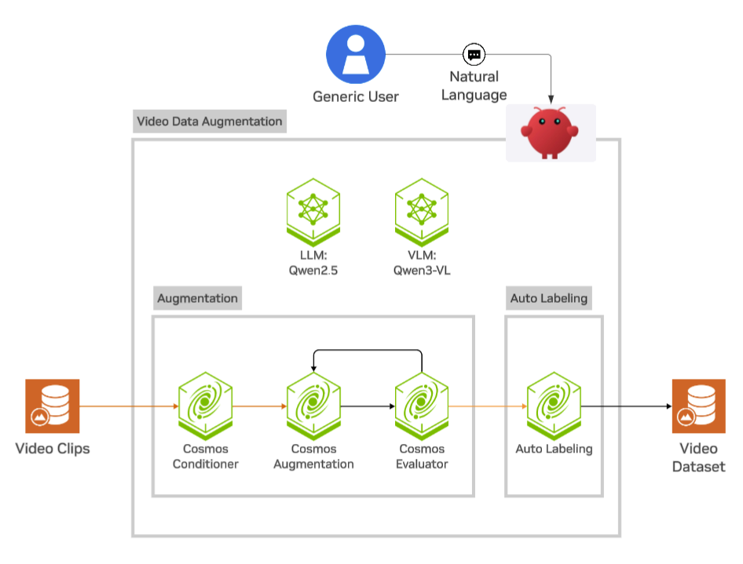

# Physical AI Video Data Augmentation

Provision an environment with the following resource requirements:

- 4 x RTX PRO Server 6000 (96 GiB)
- 1 TB storage
- 96 CPUs | 1 TiB RAM

This guide describes a ready environment for running video data augmentation
and auto-labeling workflows on NVIDIA OSMO. It is designed for teams that
want to transform raw videos into augmented clips plus structured labels
(detections, tracks, captions, event metadata, and MCQs) without wiring the
full stack manually.

The workflow is driven through the in-repo skill under `skills/physical-ai-video-data-augmentation/` and supports both quick demo runs and production runs against your own datasets.

## Before You Run

Before running any workflow, open Claw or your preferred coding agent in the deployed environment and gather the credentials below:

- **NVIDIA Build API key, or your coding agent's API key** — Powers your agent harness for endpoint-backed model calls.
  - Create or manage your key at https://build.nvidia.com/settings/api-keys.
  - Alternatively, use NVIDIA Inference endpoints by creating/managing a key at https://inference.nvidia.com/key-management.
  - You can switch models from the agent UI at any time, or optionally supply an Anthropic/Claude key to use third-party providers.

- **Hugging Face read token** — required for gated model and dataset downloads.
  - Accept model terms for:
    - [Cosmos-Transfer2.5-2B](https://huggingface.co/nvidia/Cosmos-Transfer2.5-2B)
    - [Cosmos-Predict2.5-2B](https://huggingface.co/nvidia/Cosmos-Predict2.5-2B)
    - [Cosmos-Guardrail1](https://huggingface.co/nvidia/Cosmos-Guardrail1)
  - Create a read token:
    - [Hugging Face token page](https://huggingface.co/settings/tokens/new?tokenType=read)

- **NGC credentials (optional)** — optional for this environment's default VDA workflow path.

Complete onboarding before you ask Claw or your coding agent to run setup or submit workflows.

## What This Workflow Does



The environment orchestrates OSMO workflows that implement a GPU-accelerated, multi-stage pipeline. The pipeline transforms indoor and outdoor video footage into VLM-ready labeled datasets. It uses [Cosmos Transfer 2.5](https://github.com/nvidia-cosmos/cosmos-transfer2.5) for photorealistic weather and lighting augmentation. The workflow can run in four modes:

| Mode | What runs | Typical use |
|---|---|---|
| `augmentation_and_al` | augmentation -> auto-labeling on augmented videos | Default for "augment and label" requests |
| `auto_labeling` | Auto-labeling on original videos only | Label, caption, and event extraction without augmentation |
| `e2e` | Auto-label originals and run augmentation in parallel -> auto-label augmented | Explicit fast or parallel e2e path (no SR gating) |
| `e2e_super_resolution` | SR + auto-label originals (sequentially gated) -> augmentation -> auto-label augmented | Best for low-resolution inputs when quality matters |

The workflow stages scripts and configs, launches worker tasks, and writes outputs to object storage for download and inspection.

### What the Pipeline Produces

Given a set of input `.mp4` videos and a configuration specifying desired weather/lighting variations, the pipeline outputs:

- **Augmentation configs** — Per-video YAML files with sampled weather, time-of-day, and road conditions
- **Auto-labels (original)** — Detection, tracking, and VLM-generated captions for the raw footage
- **Augmented videos** — Photorealistic re-renderings with varied weather and lighting via Cosmos Transfer 2.5
- **Auto-labels (augmented)** — Detection, tracking, and VLM-generated captions for the augmented footage

### Pipeline Stages

| Stage | Name | Purpose | Parallelism |
|-------|------|---------|-------------|
| 1 | Config Generation | Sample weather/lighting combos, produce per-video YAML configs | Single task |
| 2a | Auto-Labeling (Original) | Run detection + tracking + VLM captioning on raw videos | Single task (VLM server + processing) |
| 2b | Augmentation | Apply weather/lighting transforms via Cosmos Transfer 2.5 | Dynamic workers (W = ceil(total_configs / batch_size)) |
| 3 | Auto-Labeling (Augmented) | Run detection + tracking + VLM captioning on augmented videos | Dynamic workers (same W as Stage 2b) |

## First-Time Setup

Before the first workflow run, copy the video or videos you want to process to a location accessible from the target environment. Sample demo videos are also available and can be pulled automatically if you do not specify a video source.

The agent will:

- Verify OSMO login, profile, and pool.
- Validate credentials (`hf_token`, DATA credential, and optional `nvcr_io` refresh when provided).
- Confirm storage paths and model-cache configuration.
- Run preflight checks.
- Stage input data and submit the workflow.
- Monitor until completion and return output URLs.

## Input Options

You can run from any of the following:

- Your own dataset URL in object storage (`s3://`, `swift://`, and so on), or
- A local folder uploaded during the run, or
- Built-in demo assets (from Huggingface dataset) for quick validation.

If you do not provide inputs, ask for a demo run explicitly. The agent can stage demo videos first.

## Example Prompts

```text
I want a demo for video augmentation using this video https://huggingface.co/datasets/nvidia/video-data-augmentation-demo/blob/main/03_IllegalOccupation_020_10FPS.mp4. My Hugging Face token is <hf_token>
```

```text
Augment my video <s3 location or any public location> to create diversity in my dataset. Also show MCQs
```

```text
Demo video augmentation for me
```

## Typical Outputs

Successful runs produce OSMO output artifacts such as:

- Augmented videos
- Auto-label outputs (detections and tracks)
- Caption and event metadata JSON
- MCQ JSON outputs
- Per-run logs and generated configs

The agent can also download outputs locally when you provide a destination path.

## Examples
| Input Prompt | Input Video | Augmented Video | Generated MCQ |
| --- | --- | --- | --- |
| Run augmentation and captions on the video at \<path\>. Augment the video to have **sunny conditions**. | <video src="./media/03_IllegalOccupation_020_10FPS.mp4" width="950" controls> | <video src="./media/03_IllegalOccupation_020_10FPS_aug.mp4" width="720" controls> | <pre><code>{<br>  ...<br>  "items": [<br>    {<br>      "video_id": "augmented_video",<br>      "question": "What are the current weather conditions in the scene?",<br>      "answer": "A",<br>      "options": {<br>        "A": "Clear",<br>        "B": "Overcast",<br>        "C": "Rain"<br>      },<br>      "reasoning": "The sky is bright blue and clear, with no clouds visible, and the overall lighting is bright, indicating clear weather conditions."<br>    },<br>    ...<br>  ]<br>}</code></pre> |
| I have this video \<path\>, i want to create augmented videos with the **dim lighting**. | <video src="./media/goal_0086_0hz_6sec.mp4" width="900" controls> | <video src="./media/goal_0086_0hz_6sec_aug.mp4" width="720" controls> | <pre><code>{<br>  ...<br>  "items": [<br>    {<br>      "video_id": "augmented_video",<br>      "question": "What best describes the floor surface condition?",<br>      "answer": "A",<br>      "options": {<br>        "A": "Dry",<br>        "B": "Wet",<br>      },<br>      "reasoning": "The floor appears clean and dry throughout the video, with no visible wet spots or puddles, indicating a dry surface condition."<br>    },<br>    ...<br>  ]<br>}</code></pre> |

## What you can build with this

This environment is useful for:

- Expanding limited video datasets with controlled weather and time-of-day variation
- Creating auto-labeled corpora for VLM and perception model training
- Producing MCQ and event annotations for downstream QA and evaluation loops
- Running reproducible data augmentation jobs through a single OSMO workflow path

## Scaled-Out Testing on Your Own OSMO Cluster

You can run scaled-out testing on your own OSMO cluster using the same
`physical-ai-video-data-augmentation` workflow from this environment. Ensure
the minimum compute requirements match the resource guidance above.

Use this approach when you want to validate throughput, worker scaling, and cost or performance under production-like infrastructure.

Recommended approach:

- Keep the same workflow mode and run pattern you used in prior runs.
- Point runs to your own pool or cluster profile and object storage paths.
- Start with a workflow of your choice and increase dataset size, `n_augmentations`, and parallel workers in increments.
- Run a baseline with internal or external VLM or LLM servers.

Example prompt:

```text
Run a scaled-out test on my OSMO cluster using the same physical-ai-video-data-augmentation workflow.
```

```text
Use video <video path>, run <x> augmentations in parallel and generate MCQs. Monitor the workflow progress.
```

```text
Report workflow duration, failures, and output quality checks at each step.
```
